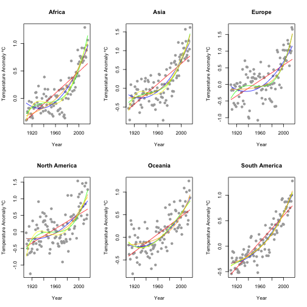

<style>
.small-code pre code {
  font-size: 70%;
}
</style>

Global Warming Shiny App
========================================================
author: Maria A. Flores
date: 9 June 2016
autosize: false

Introduction
========================================================
The Global Warming Shiny App is intended to explore the evolution of 
the land temperature anomalies in six different continental regions. Additionally, it shows a prediction for the next 10 years (2016-2026).

The data is from the NOAA databases <http://www.ncdc.noaa.gov/cag/>. There is a data set for six continental regions. 

Each dataset have the land temperature anomalies in a time series with two columns: the year and the anomaly value in Celsius degrees.

Before building the app
========================================================
class: small-size
<div class="small-size" style="font-size:80%;">
For each continental region five different regression models were tested: lineal, orthogonal polynomial of 2nd, 3rd and 4th degrees, non-orthogonal polynomial of 4th degree and exponential.
<br><br>
In order to choose the model, _anova_ and _AIC_ functions were used, selecting the best model for each region. Finally, the residuals vs fitted values are plotted, to discard hidden patterns.</div>
***
<br>


Before building the app
========================================================
class: small-size
<div class="small-font", style="font-size:70%">


```r
# Sample process, repeated for each region:

# Compare the lineal models
anova(sAmericaFit1, sAmericaFit2)
anova(sAmericaFit2, sAmericaFit3)
anova(sAmericaFit3, sAmericaFit4p)

# For South America, this is the best lineal model
summary(sAmericaFit2)

# Compare the best lm vs the nls model
AIC(sAmericaFit2, sAmericaFit5)
```
***
<div class="small-font", style="font-size:70%">Best models:
<ul>
<li>- Africa: polynomial 4th degree</li>
<li>- Asia: polynomial 4th degree</li>
<li>- Europe: polynomial 4th degree</li>
<li>- North America: polynomial 4th degree</li>
<li>- Oceania: polynomial 2nd degree</li>
<li>- South America: polynomial 2nd degree</li>
</ul>

Due to the difficult calculation of prediction intervals for exponential models
(_nls_ objects), for Europe and South America was selected the second best model.

The Global Warming App
========================================================
<div class="small-size" style="font-size:50%;">
The ui.R interface was built using the [shinydashboard](http://rstudio.github.io/shinydashboard/index.html) library, with three tabs.

The selector in the left panel is used to change the continental region in the _Dashboard_ and _Data_ tabs. Changing the region, a reactive sentence in server.R changes the used dataset, changing the plot, the fitting, the prediction interval, the data in _Data_ tab and some text outputs.

In _Dashboard_ tab, the plot is using [rCharts](http://rcharts.io/). In the box in the right side there is a slider that allows, by means of reactive sentences in server.R, to choose the year, moving a point in the fitted line and changing the values.

In _Data_ tab there is a table with the data used in the app (original and calculated). The table is built using the [DT](http://rstudio.github.io/DT/) library.

In the _Reference_ tab there is some documentation about using the app.
<br>

